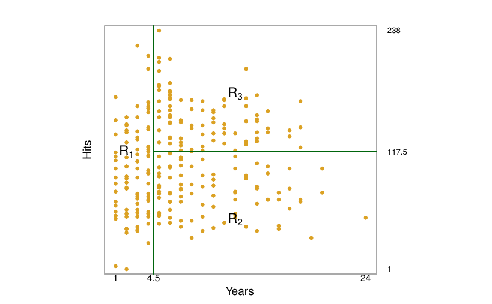
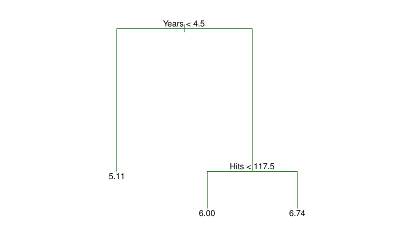
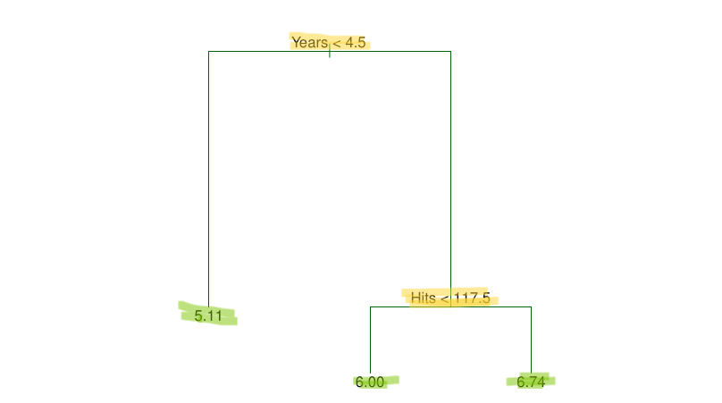

```{r}
#| include: false
#| warning: false

library(tidyverse)
library(tidymodels)
library(openintro)
library(ISLR2)
library(tree)
library(randomForest)
library(gbm)
library(BART)
library(palmerpenguins)
library(glue)
library(ggtext)
```

# Hello

::::{.columns}

:::{.column}

[I am Ayush.]{.fragment fragment-index="1" style="font-size:45px"}

[I am a researcher working at the intersection of data, development and economics.]{.fragment fragment-index="2" style="font-size:25px"}

[I am a [RStudio (Posit) certified tidyverse Instructor.](https://education.rstudio.com/trainers/people/patel+ayush/)]{.fragment fragment-index="3" style="font-size:25px"}

[I am a Researcher at [Oxford Poverty and Human development Initiative (OPHI)](https://ophi.org.uk/), at the University of Oxford.]{.fragment fragment-index="4" style="font-size:25px"}

:::

:::{.column}

](https://images.metmuseum.org/CRDImages/dp/original/DP808141.jpg){fig-align="center" height=400 .lightbox}
 

:::

::::

# Did you come prepared?

::::{.columns}

:::{.column}
- You have installed R. If not see [this link]().

- You have installed RStudio/Positron/VScode or any other IDE. It is recommended that you work through an IDE

- You have the libraries `{tree} {gbm} {randomForest} {BART}` installed

:::

:::{.column}

](https://images.metmuseum.org/CRDImages/aa/original/DT5333.jpg){fig-align="center" height=400 .lightbox}


:::

::::


# Learning Goals

1. What are decision trees?
2. When to use them?
3. How do these work?
4. Application and interpretation.
4. Improving decision trees using ensemble methods.

# Decision Trees

<br>
[Supervised and non-parametric]{.fragment fragment-index='1'}
<br><br>
[Can be used for Classification and Regression]{.fragment fragment-index='2'}
<br><br>
[A predictor space is cut into segments and mean response of training observations is used as the estimate of response of test observations.]{.fragment fragment-index='3'}
<br><br>
[Simple, easy to interpret but not the *best* for prediction accuracy on its own]{.fragment fragment-index='4'}
<br><br>
[Prediction accuracy can be improved by ensemble methods]{.fragment fragment-index='5'}

# Intuition - How it works

```{r}
#| echo: false
#| fig-cap: Can you Identify regions with similar salary range?


Hitters |>
    ggplot(aes (y = Hits, x = Years)) +
    geom_point(aes(colour = Salary), size = 3) +
    guides(colour = guide_colourbar(barwidth = unit(15, "cm"), 
    barheight = unit(1, "cm")))+
    colorspace::scale_color_continuous_divergingx(
        palette = "RdYlBu",
        name = "Salary Quantiles",
        breaks = ~ quantile(.x, na.rm=T))+
    labs(
        y = "X1: Number of hits in the previous season",
        x = "X2: Number of years in the league",
        title = "Predictor Space"
    )+
    theme_minimal() +
    theme(
        plot.title.position = "plot",
        legend.position = "top",
        legend.title.position = "top",
        legend.direction = "horizontal"
    )

```

# Intuition - How it works

```{r}
#| echo: false
#| fig-cap: Can you Identify regions with similar salary range?


Hitters |>
    ggplot(aes (y = Hits, x = Years)) +
    geom_point(aes(colour = Salary), size = 3) +
    geom_vline(aes(xintercept = 4.8)) +
    guides(colour = guide_colourbar(barwidth = unit(15, "cm"), 
    barheight = unit(1, "cm")))+
    colorspace::scale_color_continuous_divergingx(
        palette = "RdYlBu",
        name = "Salary Quantiles",
        breaks = ~ quantile(.x, na.rm=T))+
    labs(
        y = "X1: Number of hits in the previous season",
        x = "X2: Number of years in the league",
        title = "Predictor Space"
    )+
    theme_minimal() +
    theme(
        plot.title.position = "plot",
        legend.position = "top",
        legend.title.position = "top",
        legend.direction = "horizontal"
    )

```

# Intuition - How it works

```{r}
#| echo: false
#| fig-cap: Can you Identify regions with similar salary range?


Hitters |>
    ggplot(aes (y = Hits, x = Years)) +
    geom_point(aes(colour = Salary), size = 3) +
    geom_vline(aes(xintercept = 4.8)) +
    annotate(geom = "segment",x = 4.8, y = 125, xend = 25, yend = 125) + 
    guides(colour = guide_colourbar(barwidth = unit(15, "cm"), 
    barheight = unit(1, "cm")))+
    colorspace::scale_color_continuous_divergingx(
        palette = "RdYlBu",
        name = "Salary Quantiles",
        breaks = ~ quantile(.x, na.rm=T))+
    labs(
        y = "X1: Number of hits in the previous season",
        x = "X2: Number of years in the league",
        title = "Predictor Space"
    )+
    theme_minimal() +
    theme(
        plot.title.position = "plot",
        legend.position = "top",
        legend.title.position = "top",
        legend.direction = "horizontal"
    )

```

# Intuition - How it works

```{r}
#| echo: false
#| fig-cap: Can you Identify regions with similar salary range?


Hitters |>
    ggplot(aes (y = Hits, x = Years)) +
    geom_point(aes(colour = Salary), size = 3) +
    geom_vline(aes(xintercept = 4.8)) +
    annotate(geom = "segment",x = 4.8, y = 125, xend = 25, yend = 125) + 
    annotate(geom = "text",x = 2.5, y = 125, 
    label = "R1", colour = "red", alpha = 0.3, size = 20) + 
    annotate(geom = "text",x = 15, y = 200, 
    label = "R3", colour = "red", alpha = 0.3, size = 20) + 
    annotate(geom = "text",x = 15, y = 50, 
    label = "R2", colour = "red", alpha = 0.3, size = 20) + 
    guides(colour = guide_colourbar(barwidth = unit(15, "cm"), 
    barheight = unit(1, "cm")))+
    colorspace::scale_color_continuous_divergingx(
        palette = "RdYlBu",
        name = "Salary Quantiles",
        breaks = ~ quantile(.x, na.rm=T))+
    labs(
        y = "X1: Number of hits in the previous season",
        x = "X2: Number of years in the league",
        title = "Predictor Space"
    )+
    theme_minimal() +
    theme(
        plot.title.position = "plot",
        legend.position = "top",
        legend.title.position = "top",
        legend.direction = "horizontal"
    )

```

# Model output - Predictor Space



#  Model output - Tree



# Region representation

<br><br>

[$R1 = \left\{X|Years<4.5\right\}$]{.fragment fragment-index='1'}
<br><br>
[$R2 = \left\{X|Years>=4.5,Hits<117.5\right\}$]{.fragment fragment-index='2'}
<br><br>
[$R2 = \left\{X|Years>=4.5,Hits>=117.5\right\}$]{.fragment fragment-index='3'}

# Tree terminology



# How *should* we carry out segmenting of predictor space?

# Segmenting - Theory

[Predictor Space of $p$ variables needs to be segmented into $J$ different regions.]{.fragment fragment-index='1'}
<br><br>
[**In theory**, the regions can be of any shape, however high-dimensional rectangles are chosen in practice for computational ease and interpretability]{.fragment fragment-index='2'}
<br><br>
[For every observation in region $R_j$, we make the same prediction. Mean or mode of the training observations in region $R_j$]{.fragment fragment-index='3'}
<br><br>
[Minimize: $\sum_{j=1}^{J}{\sum_{i \in R_j}{(y_i - \hat{y}_{R_j})^2}}$]{.fragment fragment-index='4'} 

# But 

[Not easy to consider all possible cutpoints for all possible predictors with all possible sequences]{.fragment fragment-index='1'}
<br><br>
[We use high-dimensional rectangles instead of any shape for ease of interpretation.]{.fragment fragment-index='2'}

# So, use Recursive Binary splitting

[*top-down*]{.fragment fragment-index='1'}
<br><br>
[**greedy**]{.fragment fragment-index='2'}

# top-down

<br><br>

> We brgin at the point where all observations are part of the same region. Hence the name *top-down*

# Greedy

<br><br>

> *Best split at a particular step.* We do not care about the future. A predictor $p$ and a cutpoint $s$ is chosen based on which split will lead to the lowest RSS.

This is carried out recursively, over and over again.

# Formally

We aim to minimize the following at every step
<br><br>


> $\sum_{i:x_i \in R_1 (j,s)}{(y_i - \hat{y}_{R_1})^2} + \sum_{i:x_i \in R_2 (j,s)}{(y_i - \hat{y}_{R_2})^2}$

# Fitting Regresison Trees


# Fitting Regresison Trees

```{r}
#| echo: true

tree(body_mass_g ~ ., data = penguins) -> peng_mass_tree

peng_mass_tree
```

# Fitting Regression Trees

```{r}
#| echo: true

peng_mass_tree$frame
```

# Fitting Regression Trees

```{r}
#| echo: true

peng_mass_tree$where
```

# Fitting Regression Trees


```{r}
#| echo: true

summary(peng_mass_tree)
```

# Fitting Regression Trees


```{r}
#| echo: true

plot(peng_mass_tree)
text(peng_mass_tree, pretty = 0)

```

# Fitting Regression Trees


```{r}
#| echo: true

na.omit(penguins) |>
    mutate(
        pred_mass = predict(peng_mass_tree)
    ) |>
        relocate(body_mass_g, pred_mass, everything())
```

# Do it yourself

<br>
Run the linear model using the penguins data:
<br>
$bodymass = species + sex$
<br>
compare the RSS for the linear model with the RSS of the decision tree.

# Cant just keep splitting

<br>
some terminal nodes have very few observations
<br>

```{r}
tree(Salary ~ ., data = Hitters) -> sal_hit_tree

sal_hit_tree
```

# Cant just keep splitting

```{r}
#| echo: false
tree(Salary ~ ., data = Hitters) -> sal_hit_tree

plot(sal_hit_tree)
text(sal_hit_tree, pretty = 0)

```

# So, when to stop
<br>
[The recursive splitting approach is likely to overfit]{.fragment fragment-index='1'}
<br><br>
[Leads to a complex tree]{.fragment fragment-index='2'}
<br><br>
[A realtively smaller tree can avoid overfitting via lower variance. Providing better interpretation at the cost of little bias]{.fragment fragment-index='3'}
<br><br>
[One could say that we split only if reduction in RSS is larger than some value. But this can be short sighted]{.fragment fragment-index='4'}

# So what to do
<br>
[Grow the full Tree.]{.fragment fragment-index='1'}
<br><br>
[Prune it back to a smaller subtree]{.fragment fragment-index='2'}
<br><br>
[*But which is the best subtree*]{.fragment fragment-index='3'}
<br><br>
[Well, intuitively, one that leads to the lowest test error rate]{.fragment fragment-index='4'}

# Finding the best subtree

<br>
[We can use cross-validation to estimate test error rate]{.fragment fragment-index='1'}
<br><br>
[But there can be so many subtrees]{.fragment fragment-index='2'}
<br><br>
[So, we can select some small number of trees using cost complexity pruning or weakest link pruning]{.fragment fragment-index='3'}

# Cost Complexity Pruning

<br><br>

$\sum_{m=1}^{|T|}{\sum_{i:x_i \in R_m}{(y_i - \hat{y}_{R_m})^2}} + \alpha |T|$

# The Combined Algorithm

1. Use Recursive binary splitting to grow a large tree.
2. Apply cost complexity pruning to get a sequence of best subtrees, as a function of $\alpha$
3. Use K-fold CV to choose $\alpha$.
    1. Repeat steps 1 and 2 on all but the Kth fold of training data
    2. Evaluate the mse on the left-out Kth fold, as a fucntion of $\alpha$. Average results of each value of $\alpha$, choose ove that minimizes average error.
4. Return the subtree from step 2 that corresponds with the value of chosen $\alpha$

# Step 1 - Grow the full tree

```{r}
#| echo: true

rsample::initial_split(data = Hitters,prop = .75) -> hit_split
rsample::training(hit_split) -> train_tree
rsample::testing(hit_split) -> test_tree

tree(Salary ~ ., data = train_tree) -> sal_hit_tree
```

# Step 2 - Apply Cost Complexity Pruning


```{r}
#| echo: true

prune.tree(sal_hit_tree)
```

# Step 3  - Apply CV to choose $\alpha$

```{r}
#| echo: true

cv.tree(sal_hit_tree,FUN = prune.tree) -> cv_pruned_estimates

cv_pruned_estimates
```

# Step 3 - Apply CV to choose $\alpha$

```{r}
#| echo: true
#| output-location: slide

tibble(
    leaves = cv_pruned_estimates$size,
    rss = cv_pruned_estimates$dev
) |>
    ggplot(aes(leaves, rss)) +
    geom_point()+
    geom_line()+
    theme_minimal()
```


# Step 4 - get the subtree from the large tree


```{r}
#| echo: true

prune.tree(sal_hit_tree, best = 3) -> best_sub_tree_sal

plot(best_sub_tree_sal)
text(best_sub_tree_sal, pretty = 0)
```

# Lets predict using the model
```{r}
#| echo: true

predict(best_sub_tree_sal, test_tree)
```

# Do it yourself

For the `Boston` data set from {ISLR2}, run a decision tree model that estimates the median value of owner-occupied homes in $1000. Complete the full algorith steps of growing a larger tree and choosing an alpha for the best possible subtree.

# Classification Trees

[Response is qualitative]{.fragment fragment-index='1'}
<br><br>
[For making predictions, instead of using the *mean* of the training observations in a region, the *most commonly occuring* class of training observations in a region is used.]{.fragment fragment-index='2'}
<br><br>
[Classification trees are grown in a similar fashion to regression trees]{.fragment fragment-index='3'}
[But, instead of RSS we use the *classification error rate*]{.fragment fragment-index='4'}
<br><br>
[Classification Error Rate (E): The fraction of training observations in a region that do not belong to the most common class.]{.fragment fragment-index='5'}

# Classification Error Rate

<br>
$$E = 1- max(\hat{p}_{mk}) $$

Here $\hat{p}_{mk}$ is the proportion of training observations in the mth region of class k.
<br><br>
But, this is not *sufficiently sensitive* for tree growing, so we use other measures in practice.

# Classification Error Rate - Issues

:::: {.columns}
::: {.column}

```{mermaid}
%%| fig-height: 10
%%| fig-width: 6

flowchart 
    A[A50,B50] --> B[A10,B40]
    A[A50,B50] --> C[A40,B10]

```

:::
::: {.column}
```{mermaid}
%%| fig-height: 10
%%| fig-width: 6

flowchart 
    A[A50,B50] --> B[A50,B20]
    A[A50,B50] --> C[A0,B30]

```

:::
::::
<!-- end columns -->

# Classification Error Rate - Issues

[Does not favour "pure" nodes]{.fragment fragment-index='1'}
<br><br>
[Only cares about the *most common class*, ignores *by how much*]{.fragment fragment-index='2'}
<br><br>
[May result in premature stop in tree growing]{.fragment fragment-index='3'}
<br><br>
[Insensitive to minor changes in patterns]{.fragment fragment-index='4'}

# Alternative - Gini

<br><br>
$G = \sum_{k=1}^{K}{\hat{p}_{mk}(1-\hat{p}_{mk})}$
<br><br>
The Value of G will be small when node purity is high.

# Alternative - Entropy

<br><br>
$D = - \sum_{k=1}^{K}{\hat{p}_{mk}log\hat{p}_{mk}}$
<br><br>
The value of D will be near zero for $\hat{p}_{mk}$ near zero or one

# Classification Error Rate - Issues
```{r}
#| echo: true
#| output-location: slide

tibble::tibble(
  prop_a = seq(0,1,by = 0.001),
  prop_b = 1- prop_a,
  max = ifelse(prop_a>=prop_b, prop_a, prop_b),
  E =  1 - max,
  G = 2*(prop_a*prop_b),
  En = -1*((prop_a*log(prop_a))+(prop_b*log(prop_b)))
)  |> 
  ggplot2::ggplot(ggplot2::aes(prop_a,E))+
  ggplot2::geom_line() +
  ggplot2::geom_line(ggplot2::aes(y = G), colour = "green") +
  ggplot2::geom_line(ggplot2::aes(y = En), colour = "steelblue") +
  ggplot2::theme_minimal() +
  ggplot2::labs(
    x = "probablity of Class A at a given node",
    y = "Y",
    title = "Comparing Classificaiton Error Rate, Gini and Entropy",
    subtitle = "Toy example with two classes: A and B"
  )
```

# A comment on E, G and D

<br><br>
[Best to use G or D for splitting]{.fragment fragment-index='1'}
<br><br>
[For pruning and gauging overall accuracy E is preferable if prediction accuracy is the goal.]{.fragment fragment-index='2'}
<br><br>
[The {tree} takes care of all this by default]{.fragment fragment-index='3'}

# code refrence

```{r}
#| echo: true
#| eval: false

tree(league ~ . , data = Hitters) -> mod

prune.tree(mod, method = "misclass")

cv.tree(mod, FUN = prune.misclass)


```

# Do it yourself

[This link](https://www.statlearning.com/s/Heart.csv) has the `Heart data` for paitents with chest pains. The variable `AHD` is a binary variable where `Yes` refers to existing heart disease. Create a decision tree model, a full grown tree, to understand factors for predicting `AHD`. Also, prune this tree by choosing the appropriate $\alpha$. Write an interpretation note for your model.
<br>
Does your final and full grown trees have some splits that estimate the same response for terminal nodes? Why does that happen?

# Decision Trees

:::: {.columns}
::: {.column}
1. Easy to interpret
2. Can handle qualitative as well as quantitative response
:::
::: {.column}
1. Not as great for prediction accuracy as some other regression or classification approaches.
2. Small changes in training data can lead to large chanages in the final estimated tree.
:::
::::
<!-- end columns -->

# Aggregating many trees can imporve performance (prediction)
<br><br>

Ensemble Mehtods: Bagging, random forests, boosting, and Bayesian additive regression trees.

# Ensemble Methods
<br>
[Combine many simple models to get one powerful model]{.fragment fragment-index='1'}
<br><br>
[These simple models are sometimes known as *weak learners*]{.fragment fragment-index='2'}
<br><br>

# Bagging

<br>
[Remember *Bootstrap*?]{.fragment fragment-index='1'}
<br><br>
[Can be used to estimate the SD of the quantity of interest where it is hard or impossible to directly compute it.]{.fragment fragment-index='2'}
<br><br>
[Can be also used to imporve statistical learning models like decision trees]{.fragment fragment-index='3'}
<br><br>

# Bagging - before we get into it

> "*Averaging a set of observations reduces variance*"

# Bagging - before we get into it

> Imagine a natural process that generates $n$ observation $Z_1, Z_2, ...,Z_n$ with Variance $\sigma^2$. Stats says that the variance of $\bar{Z}$ is $\frac{\sigma^2}{n}$


```{r}
#| echo: true

rnorm(n = 100,mean = 5,sd = 10) -> Z_i

Z_i

var(Z_i)
```

# Bagging - before we get into it

I estimate the variance of mean, it should be ($\frac{\sigma^2}{n}$)


```{r}
#| echo: true

purrr::map_dbl(
  c(1:100),
  ~ rnorm(n = 100, mean = 5, sd = 10) |>
    mean()
) |> var()
```

# Bagging - before we get into it

I estimate the distribution of variance of mean, it should be *centered* around ($\frac{\sigma^2}{n}$)


```{r}
#| echo: true
#| output-location: slide

purrr::map_dbl(
    c(1:1000),
    ~purrr::map_dbl(
  c(1:100),
  ~ rnorm(n = 100, mean = 5, sd = 10) |>
    mean()
) |> var()
) |>
    density()|>
    plot("Distribution of the variance of mean")
```

# Bagging - before we get into it

<br><br>
> So, averaging stuff reduces the variance, we can be sure. Natuarally, we can reduce the variance of a statistical learning methods by averaging.

# Bagging

<br>
[So, take multiple training sets]{.fragment fragment-index='1'}
<br><br>
[Grow a full tree for each training sets]{.fragment fragment-index='2'}
<br><br>
[Average the resulting predictions]{.fragment fragment-index='3'}
<br><br>
[$\hat{f}_{avg} = \frac{1}{B}\sum_{b=1}^{B}{\hat{f}^b}$]{.fragment fragment-index='4'}
<br><br>
[But I dont ahve so much training data]{.fragment fragment-index='5'}

# Bagging

So, Bootstrap. Bootstrap + Aggregating = Bagging

<br><br>

$\hat{f}_{bag} = \frac{1}{B}\sum_{b=1}^{B}{\hat{f}^{*b}}$

# Bagging

<br>
[These trees are grown deep]{.fragment fragment-index='1'}
<br><br>
[Not Pruned]{.fragment fragment-index='2'}
<br><br>
[So each individual tree has high variance and low bias.]{.fragment fragment-index='3'}
<br><br>
[Averaging the trees reduces the variance]{.fragment fragment-index='4'}
<br><br>
[In classification setting we use majority vote instead of average]{.fragment fragment-index='5'}

# Bagging - How well it performs?

<br><br>
 
> I want to compare the Bagging test error rate with the unpruned single tree test error rate and pruned single tree test error rate.

# Bagging - How well it performs?

<br>
I will use the orange juice data set to work this example
<br>

```{r}
#| echo: false

OJ |>
    glimpse()
```

# Bagging - How well it performs?

**Steps**

1. Split data in training and test.
2. On the training data grow a decision tree for classification. (Mod1)
3. Find the error rate of Mod1 on test data.
4. Prune the Mod1 by finding $\alpha$ through CV. Call this model Mod2.
5. Find error rate of Mod2 on test data.
6. Split the training data in 300 bootstrap samples. Grow a tree for each of the 300 samples. 
7. Using all 300 trees predict error rate for test data. (Bagging test error rate) 
8. Do point 7 sequentially to show how Bagging test error rate changes with number of bootstrap samples.(E by using Bootstrap sample 1 only, then with 1 and 2, then 1 to 3, till 1 to 300)

# Bagging - How well it performs?

**Step1**: Split data in training and test.
<br>

```{r}
#| echo: true

rsample::initial_split(data = OJ, prop = .9) -> oj_split
rsample::training(oj_split) -> oj_train
rsample::testing(oj_split) -> oj_test

```

# Bagging - How well it performs?

**Step2**: On the training data grow a decision tree for classification. (Mod1)
<br>

```{r}
#| echo: true

tree(Purchase ~., oj_train) -> Mod1

```

# Bagging - How well it performs?

**Step3**: Find the error rate of Mod1 on test data.
<br>

```{r}
#| echo: true

Mod1_test_error <- sum(
    predict(Mod1, oj_test, "class") != oj_test$Purchase
    )/107
```

# Bagging - How well it performs?

**Step4**: Prune the Mod1 by finding $\alpha$ through CV. Call this model Mod2.
<br>

```{r}
#| echo: true

map(
    c(1:100),
    ~tibble(
        size = cv.tree(Mod1,FUN = prune.misclass)[["size"]],
        e = cv.tree(Mod1,FUN = prune.misclass)[["dev"]]
    )
) |>
    list_rbind()|>
    group_by(size) |>
    summarise(
        mean_e = mean(e, na.rm = T)
    )

prune.tree(Mod1,best = 4) -> Mod2
```

# Bagging - How well it performs?

**Step5**: Find error rate of Mod2 on test data
<br>

```{r}
#| echo: true

Mod2_test_error <- sum(
    predict(Mod2, oj_test, "class") != oj_test$Purchase
    )/107
```

# Bagging - How well it performs?

**Step6&7**: Split the training data in 300 bootstrap samples. Grow a tree for each of the 300 samples. Using all 300 trees predict error rate for test data. (Bagging test error rate) 
<br>

```{r}
#| echo: true
#| code-fold: true
rsample::bootstraps(oj_train,times = 300) -> oj_train_boot

get_dist_error_test_set <- function(i){

    tree(Purchase ~ ., data = rsample::get_rsplit(oj_train_boot,index = i) |> 
    as.data.frame()
        ) -> tree_oj

    tibble(
        "b_{i}" := predict(tree_oj, oj_test, "class")
    )

}

map(
    c(1:300),
    get_dist_error_test_set
) |>
    list_cbind() -> boot_predicts

boot_predicts |> 
    as.matrix() |> 
    t() |> 
    as.data.frame() -> boot_predicts

boot_predicts

```

# Bagging - How well it performs?

**Step8**: Do point 7 sequentially to show how Bagging test error rate changes with number of bootstrap samples.(E by using Bootstrap sample 1 only, then with 1 and 2, then 1 to 3, till 1 to 300)
<br>


```{r}
#| echo: true
#| output-location: slide
    
across_boots_acc <- function(i) {
    
    boot_predicts[c(1:i),] |>   
    summarise(across(everything(),~ attr(sort(table(.x),decreasing = T)[1],"name"))) |> 
    t() |> 
    as.vector() -> boot_predicts
    
    sum(boot_predicts == oj_test$Purchase, na.rm = T)/107

}

tibble(
    num_boots = c(1:300),
    bagg_test_error = 1-(map_dbl(
    c(1:300),
    across_boots_acc))
) |>
    ggplot(aes(x = num_boots, y = bagg_test_error)) +
    geom_line(colour = "steelblue")+
    geom_hline(aes(yintercept = Mod1_test_error), 
    linetype = 2, colour = "red")+
    annotate(geom = "text", 
    label = "Unpruned single tree Test error rate",
    x = 275, y = Mod1_test_error, colour = "red")+
    geom_hline(aes(yintercept = Mod2_test_error), 
    linetype = 2, colour = "red")+
    annotate(geom = "text", 
    label = "pruned single tree Test error rate",
    x = 275, y = Mod2_test_error, colour = "red")+
    labs(
        title = "Comparing test error rate estimates",
        x = "Number of bootstrap samples",
        y = "Error",
        subtitle = "Plot shows: <span style='color:steelblue;'>Bagging test error rate.</span>"
    )+
    theme_minimal() +
    theme(
        plot.title.position = "plot",
        plot.subtitle = element_markdown()
    )

```

# Bagging 

> Why are we wasting samples to get an estimate of test error rate? There is a way *Out-of-Bag Error Estimation*.

# Bagging - Out-of-Bag Error Estimation

1. On an average each bagged tree uses only 2/3 rd of the observations.
2. This would mean that there are 1/3 rd observations which are not used to fit a given bagged tree. These are called "Out-of-Bag" or OOB.
3. A given *i*th OOB observation can be predicted using B/3 trees. (By average or mode)
4. This can be achieved for all OOB observations.
5. These predictions for OOB can be compared against true values to obtain OOB MSE.
6. OOB MSE is a valid estimate of test error for the bagged model.

# Bagging error rate estimates

```{r}
#| echo: true
#| output-location: slide

randomForest::randomForest(Purchase ~. , OJ,mtry = 17) -> bag_oj

tibble(
    num_boots = c(1:300),
    bagg_test_error = 1-(map_dbl(
    c(1:300),
    across_boots_acc)),
    oob_mse = bag_oj$err.rate[c(1:300),"OOB"]
) |>
    ggplot(aes(x = num_boots, y = bagg_test_error)) +
    geom_line(colour = "steelblue")+
    geom_line(aes(y = oob_mse),
    colour = "green") +
    geom_hline(aes(yintercept = Mod1_test_error), 
    linetype = 2, colour = "red")+
    annotate(geom = "text", 
    label = "Unpruned single tree Test error rate",
    x = 275, y = Mod1_test_error, colour = "red")+
    geom_hline(aes(yintercept = Mod2_test_error), 
    linetype = 2, colour = "red")+
    annotate(geom = "text", 
    label = "pruned single tree Test error rate",
    x = 275, y = Mod2_test_error, colour = "red")+
    labs(
        title = "Comparing test error rate estimates",
        x = "Number of bootstrap samples",
        y = "Error",
        subtitle = "Plot shows: <span style='color:steelblue;'>Bagging test error rate.</span>, <span style='color:green;'>OOB MSE - Bootstrap</span>"
    )+
    theme_minimal() +
    theme(
        plot.title.position = "plot",
        plot.subtitle = element_markdown()
    )

```

# Bootstrap and interpretation

> While prediction improves, there is some loss of interpretability. To address is as best as one can, we use Variance Improtance Measures.

# Bootstrap - VIM

```{r}
#| echo: false

bag_oj$importance |>
    kableExtra::kable() |>
    kableExtra::kable_styling() |>
    kableExtra::scroll_box(width = '100%', height = '500px')
```

# Bootstrap - VIM

```{r}
#| echo: false

bag_oj$importance |>
    as.data.frame() |> 
    rownames_to_column("var") |>
    mutate(
        var = fct_reorder(var,MeanDecreaseGini)
    ) |>
    ggplot(aes(y = var,x =MeanDecreaseGini)) +
    geom_col(fill = "steelblue")+
    labs(
        x = "Mean Decrease in Gini",
        y = NULL,
        title = "Vaiable Importance Measure"
    ) +
    theme_minimal() +
    theme(
        plot.title.position = "plot",
        panel.grid.major.y = element_blank(),
        panel.grid.minor.y = element_blank()
    )
```

# Random Forest

[In bagging, though the training observations changes, most trees will look more or less alike. Especially of one of the predictors can very strongly predict the response, with other predictors that moderately precidt the response.]{.fragment fragment-index='1'}
<br><br>
[This makes us question independence of the bootstrap predictions]{.fragment fragment-index='2'}
<br><br>
[And, if independence is not observed, averaging does not reduce the variance.]{.fragment fragment-index='3'}
[Consequently, the bagging may not result in substantial reduction in the variance of the method.]{.fragment fragment-index='4'}
<br><br>
[So we decorelate the trees by forcing to use only $m$ of the $p$ predictor at every given split of every tree. usually $m = \sqrt{p}$]{.fragment fragment-index='5'}

# Random Forest OOB MSE

```{r}
#| echo: false

randomForest(Purchase ~.,data = OJ, mtry = 4) ->rf_oj

tibble(
    num_boots = c(1:300),
    bagg_test_error = 1-(map_dbl(
    c(1:300),
    across_boots_acc)),
    oob_mse = bag_oj$err.rate[c(1:300),"OOB"],
    oob_mse_rf = rf_oj$err.rate[c(1:300),"OOB"]
) |>
    ggplot(aes(x = num_boots, y = bagg_test_error)) +
    geom_line(colour = "steelblue")+
    geom_line(aes(y = oob_mse),
    colour = "green") +
    geom_line(aes(y = oob_mse_rf),
    colour = "purple") +
    geom_hline(aes(yintercept = Mod1_test_error), 
    linetype = 2, colour = "red")+
    annotate(geom = "text", 
    label = "Unpruned single tree Test error rate",
    x = 275, y = Mod1_test_error, colour = "red")+
    geom_hline(aes(yintercept = Mod2_test_error), 
    linetype = 2, colour = "red")+
    annotate(geom = "text", 
    label = "pruned single tree Test error rate",
    x = 275, y = Mod2_test_error, colour = "red")+
    labs(
        title = "Comparing test error rate estimates",
        x = "Number of bootstrap samples",
        y = "Error",
        subtitle = "Plot shows: <span style='color:steelblue;'>Bagging test error rate.</span>, <span style='color:green;'>OOB MSE - Bootstrap</span>, <span style='color:purple;'>OOB MSE - Random Forest</span>"
    )+
    theme_minimal() +
    theme(
        plot.title.position = "plot",
        plot.subtitle = element_markdown()
    )
```

# Application: Bootstraping

```{r}
#| echo: true

randomForest(Purchase ~ ., data = OJ, mtry = 17)
```

# Application: Random Forest

```{r}
#| echo: true

randomForest(Purchase ~ .,  data = OJ, mtry = 4)
```

# Do it yourself

1. Goal: Use `cells` from {modeldata} to predict the `class` variable.
2. Drop the `case` variable before doing any modeling.
3. Find the test set error rate of single unpruned tree.
4. Find the test set error rate for a single pruned tree with cost complexity pruning.
5. Find OOB MSE of the bagging model.
6. Find OOB MSE of the random forest model. 
7. explore model objects in points 5 and 6.
8. Make chart comparing test error rate estimation from points 3,4,5,and 6.
